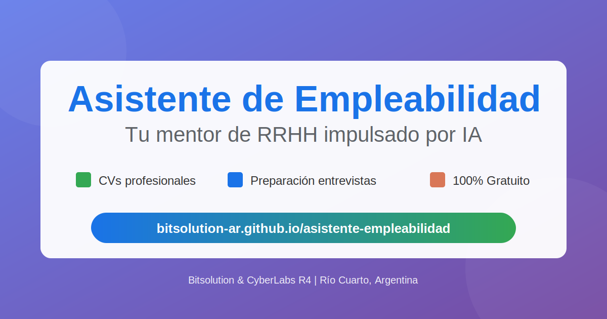

# 🎯 Asistente de Empleabilidad con IA

> Sistema profesional de búsqueda laboral impulsado por Inteligencia Artificial

[](https://bitsolution-ar.github.io/asistente-empleabilidad/)
[](LICENSE)
[](https://github.com/BITSOLUTION-AR)

---

## 📖 Sobre el Proyecto

**Asistente de Empleabilidad con IA** es una herramienta 100% gratuita que democratiza el acceso a técnicas profesionales de búsqueda laboral, poniendo expertise de 20+ años en Recursos Humanos al alcance de cualquier persona.

### ✨ Características principales

- 📝 **Creación de CVs profesionales** - Desde cero o mejorando CVs existentes
- 🎯 **Adaptación personalizada** - CV específico para cada postulación
- 🔍 **Análisis de avisos laborales** - Evaluación de compatibilidad real
- 💼 **Preparación de entrevistas** - Preguntas probables y técnica STAR
- 🚩 **Detección de red flags** - Protección contra estafas laborales
- 🇦🇷 **Optimizado para Argentina** - Adaptado al mercado local

---

## 🚀 Demo en Vivo

👉 **[Probar la aplicación](https://bitsolution-ar.github.io/asistente-empleabilidad/)**

---

## 🎮 Cómo usar

1. **Accede a la app** → [bitsolution-ar.github.io/asistente-empleabilidad](https://bitsolution-ar.github.io/asistente-empleabilidad/)
2. **Elige tu IA favorita** → Gemini, ChatGPT o Claude
3. **El sistema se copia automáticamente** → No necesitas hacer nada
4. **Pega en el chat** → Ctrl+V (o mantener presionado → Pegar en móvil)
5. **¡Listo!** → Ya puedes conversar con tu asistente personal

---

## 🤖 IAs compatibles

El sistema funciona con cualquiera de estas plataformas (todas tienen versión gratuita):

| IA | Proveedor | URL | Descripción |
|---|---|---|---|
| 🔵 **Gemini** | Google | [gemini.google.com](https://gemini.google.com) | Fácil si ya tienes Gmail |
| 🟢 **ChatGPT** | OpenAI | [chatgpt.com](https://chatgpt.com) | La más conocida |
| 🟠 **Claude** | Anthropic | [claude.ai](https://claude.ai) | Muy detallada |

---

## 💡 Casos de uso

### Caso 1: Primer empleo
```
Usuario: "Recién terminé el secundario, nunca trabajé. ¿Cómo hago un CV?"
Asistente: Guía paso a paso para identificar habilidades transferibles
           y crear CV profesional destacando educación y potencial.
```

### Caso 2: Transición de carrera
```
Usuario: "Trabajé 10 años en administración pero quiero pasarme a ventas"
Asistente: Identifica skills transferibles, reformula CV para destacar
           aspectos comerciales, prepara narrativa convincente del cambio.
```

### Caso 3: Análisis de oferta
```
Usuario: "Vi este aviso en Bumeran, ¿me conviene aplicar? [pega aviso]"
Asistente: Decodifica requisitos, evalúa compatibilidad honesta,
           detecta red flags, da recomendación clara (sí/no/prepararse más).
```

---

## 🎓 Expertise incluido

El sistema está basado en **20+ años de experiencia real en Recursos Humanos** e incluye conocimiento de:

**Sectores:** IT, Retail, Manufactura, Salud, Educación, Hostelería, Construcción, Administración, Agroindustria, Logística, Servicios profesionales, Empleo público

**Niveles:** Entry-level, Operarios, Administrativos, Profesionales, Supervisores, Gerencia media, Gerencia senior, Directores y C-suite

**Sistemas:** ATS (Applicant Tracking Systems), LinkedIn, Bumeran, Computrabajo, ZonaJobs, Indeed

**Mercado argentino:** Salarios por sector/región, legislación laboral, tendencias post-pandemia, particularidades regionales

---

## 🔐 Privacidad y seguridad

✅ **Sin recolección de datos** - Todo funciona en el navegador del usuario  
✅ **Sin registro requerido** - No pedimos email ni información personal  
✅ **Código abierto** - Puedes revisar todo el código fuente  
✅ **Sin tracking** - No usamos Google Analytics ni cookies de terceros  

**IMPORTANTE:** Nunca compartas información sensible como contraseñas, números de documento completos o datos bancarios con ninguna IA.

---

## 📚 Documentación adicional

Además de la app web, ofrecemos guías descargables completas:

1. **Guía Rápida** - Para empezar en 5 minutos
2. **Sistema Profesional Completo** - Prompt Maestro detallado
3. **Manual Completo** - Casos prácticos, tips y FAQ

*(Contacta con nosotros para obtener los documentos)*

---

## 🛠️ Tecnologías utilizadas

- **HTML5** - Estructura semántica
- **CSS3** - Diseño responsive con gradientes modernos
- **Vanilla JavaScript** - Sin dependencias, máximo rendimiento
- **Clipboard API** - Copia automática del prompt
- **GitHub Pages** - Hosting gratuito y confiable

---

## 📱 Responsive Design

La aplicación está optimizada para:
- 📱 Dispositivos móviles (Android, iOS)
- 💻 Tablets
- 🖥️ Escritorio
- 🌐 Todos los navegadores modernos

---

## 🤝 Contribuciones

Este es un proyecto de código abierto orientado al bien social. Las contribuciones son bienvenidas:

1. Fork el proyecto
2. Crea tu Feature Branch (`git checkout -b feature/MejoraNueva`)
3. Commit tus cambios (`git commit -m 'Agrega nueva funcionalidad'`)
4. Push al Branch (`git push origin feature/MejoraNueva`)
5. Abre un Pull Request

---

## 📋 Roadmap

- [x] Versión web básica
- [x] Optimización móvil
- [x] Integración con 3 IAs principales
- [ ] PWA (Progressive Web App) para instalación
- [ ] Modo offline
- [ ] Versión en otros idiomas (español de España, inglés)
- [ ] Integración con más plataformas de IA

---

## 📄 Licencia

Este proyecto está bajo la Licencia MIT - mira el archivo [LICENSE](LICENSE) para más detalles.

---

## 👥 Equipo

**Desarrollado con ❤️ por:**

- **Bitsolution** - Innovación y desarrollo
- **CyberLabs R4** - Investigación y contenido

📍 Río Cuarto, Córdoba, Argentina 🇦🇷

---

## 📞 Contacto

¿Preguntas? ¿Sugerencias? ¿Encontraste un bug?

- 📧 Email: bitsolutionrio4@gmail.com
- 💬 Issues: [Reportar un problema](https://github.com/BITSOLUTION-AR/asistente-empleabilidad/issues)
- 🌐 Web: "en mantenimiento"

---

## 🌟 Apóyanos

Si este proyecto te ayudó a conseguir trabajo o mejorar tu búsqueda laboral:

⭐ Dale una estrella al repositorio  
🔄 Compártelo con quien lo necesite  
💬 Déjanos tu feedback en [Issues](https://github.com/BITSOLUTION-AR/asistente-empleabilidad/issues)

---

## 📊 Estadísticas


---

<div align="center">

### ⚡ Hecho con amor para democratizar oportunidades laborales ⚡

**[Ver Demo](https://bitsolution-ar.github.io/asistente-empleabilidad/)** • **[Reportar Bug](https://github.com/BITSOLUTION-AR/asistente-empleabilidad/issues)** • **[Solicitar Feature](https://github.com/BITSOLUTION-AR/asistente-empleabilidad/issues)**

</div>
